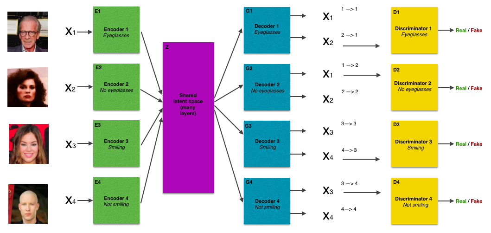

# Composable Unpaired Image to Image Translation

### Summary
There has been remarkable recent work in unpaired image-to-image translation. However, they're restricted to translation on a single pair of distributions, with some exceptions. In this study, we extend one of these works to a scalable multi-distribution translation mechanism. Our translation models not only converts from one distribution to another but can be stacked to create composite translation functions. We show that this composite property makes it possible to generate images with characteristics not seen in the training set. We also propose a decoupled training mechanism to train multiple distributions separately, which we show, generates better samples than isolated joint training. Further, we do a qualitative and quantitative analysis to assess the plausibility of the samples.

### Usage

To train translation pairs separately, and to resume training. See the original instructions [here](nvidia_original/USAGE.md)

All the commands below should be run from within the ```nvidia_original/src``` directory.

To train a joint model (learning two pairs of distributions at the same time):
```bash
python cocogan_train_fourway.py --config ../exps/unit/blondbrunette_smiling_big.yaml --log ../logs
```
To train a join model, initializing the model from two separately trained models:
```bash
python cocogan_train_fourway.py --config ../exps/unit/blondbrunette_smiling_big.yaml --warm_start 1 --gen_ab /path/to/generator_ab --gen_cd /path/to/generator_cd --dis_ab /path/to/discriminator_ab --dis_cd /path/to/discriminator_cd --log ../logs
```
To generate doubly translated images with separately trained models:
```bash
python double_loop_separately_trained.py --config ../exps/unit/double_loop.yaml --gen_ab /path/to/generator_ab --gen_cd /path/to/generator_cd
```
To generate double translated images with a joint trained model:
```bash
python generate_images.py --config ../exps/unit/four_way_generate.yaml --gen /path/to/generator --dis /path/to/discriminator
```
### Model



The images of people were selected from the celebA [1] dataset. This model extends the model proposed by M. Liu, T. Breuel, and J. Kautz in "Unsupervised image-to-image translation networks” [2].

### Results


For each triplet of images, the image on the left is the original image, selected from the celebA dataset [1]. They are all not smiling and not wearing glasses. The center image is the translation to not smiling and wearing glasses. The image on the right is the second translation to smiling and wearing glasses.


For each triplet of images, the image on the left is the original image, selected from the celebA dataset [1]. They are all not smiling and have either blond or brown hair. The center image is the translation to not smiling and either blond or brunette, depending on the original hair color. The image on the right is the second translation to smiling

### Acknowledgements

We are grateful to M. Liu, T. Breuel, and J. Kautz for making their research and codebase publicly available, without which this project would not have been possible, and to Professor Rob Fergus for his valuable advice.

### References

1. Z. Liu, P. Luo, X. Wang, and X. Tang, “Deep learning face attributes in the wild,” inProceed-ings of International Conference on Computer Vision (ICCV), 2015.
2. M. Liu, T. Breuel, and J. Kautz, “Unsupervised image-to-image translation networks,”CoRR,vol. abs/1703.00848, 2017.
