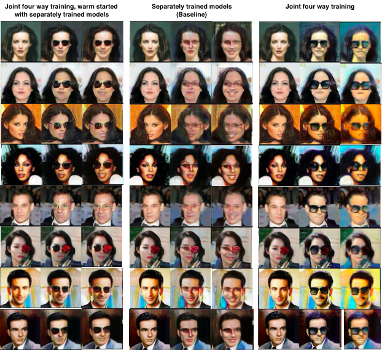
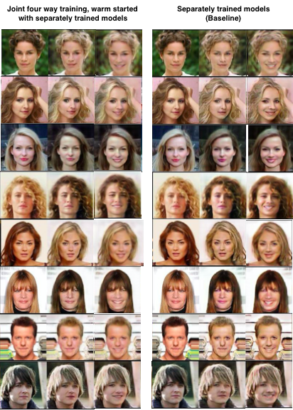

# Composable Unpaired Image to Image Translation

### Summary
Learning to translate between two image domains is a common problem in computer vision and graphics, and has many potentially useful applications including colorization [1], photo generation from sketches [1], inpainting [2], future frame prediction [3], superresolution [4], style transfer [5], and dataset augmentation. It can be particularly useful when images from one of the two domains are scarce or expensive to obtain (for example by requiring human annotation or modification).

This paper extends the idea of unpaired image to image translation by exploring whether image to image translation can be disentangled into the translation of certain components of an image, and composed. For example, instead of learning to translate from a smiling person that is wearing glasses to a person that is not smiling and not wearing glasses, or a horse in a field on a summer's day to a zebra in a field on a winter's day, we learn to translate from wearing glasses to not wearing glasses, smiling to not smiling, horse to zebra, and summer to winter separately, then compose the results.

### Usage

To train translation pairs separately, and to resume training. See the original instructions [here](nvidia_original/USAGE.md)

All the commands below should be run from within the ```nvidia_original/src``` directory.

To train a joint model (learning two pairs of distributions at the same time):
```bash
python cocogan_train_fourway.py --config ../exps/unit/blondbrunette_smiling_big.yaml --log ../logs
```
To train a join model, initializing the model from two separately trained models:
```bash
python cocogan_train_fourway.py --config ../exps/unit/blondbrunette_smiling_big.yaml --warm_start 1 --gen_ab /path/to/generator_ab --gen_cd /path/to/generator_cd --dis_ab /path/to/discriminator_ab --dis_cd /path/to/discriminator_cd --log ../logs
```
To generate doubly translated images with separately trained models:
```bash
python double_loop_separately_trained.py --config ../exps/unit/double_loop.yaml --gen_ab /path/to/generator_ab --gen_cd /path/to/generator_cd
```
To generate double translated images with a joint trained model:
```bash
python generate_images.py --config ../exps/unit/four_way_generate.yaml --gen /path/to/generator --dis /path/to/discriminator
```
### Model


The images of people were selected from the celebA [6] dataset.

### Results





### Acknowledgements

We are grateful to M. Liu, T. Breuel, and J. Kautz for making their research and codebase publicly available, without which this project would not have been possible, and to Professor Rob Fergus for his valuable advice.

### References

1.  P. Isola, J. Zhu, T. Zhou, and A. A. Efros, “Image-to-image translation with conditional adver-sarial networks,”CoRR, vol. abs/1611.07004, 2016.
2.  D. Pathak, P. Kr ̈ahenb ̈uhl, J. Donahue, T. Darrell, and A. Efros, “Context encoders:  Featurelearning by inpainting,” 2016.
3.  Y. Zhou and T. L. Berg, “Learning temporal transformations from time-lapse videos,” inCom-puter Vision - ECCV 2016 - 14th European Conference, Amsterdam, The Netherlands, October11-14, 2016, Proceedings, Part VIII, pp. 262–277, 2016.
4.  C. Ledig,  L. Theis,  F. Huszar,  J. Caballero,  A. P. Aitken,  A. Tejani,  J. Totz,  Z. Wang,  andW. Shi, “Photo-realistic single image super-resolution using a generative adversarial network,”CoRR, vol. abs/1609.04802, 2016.
5.  C. Li and M. Wand, “Precomputed real-time texture synthesis with markovian generative ad-versarial networks,” inComputer Vision - ECCV 2016 - 14th European Conference, Amster-dam, The Netherlands, October 11-14, 2016, Proceedings, Part III, pp. 702–716, 2016.
6. Z. Liu, P. Luo, X. Wang, and X. Tang, “Deep learning face attributes in the wild,” inProceed-ings of International Conference on Computer Vision (ICCV), 2015.
